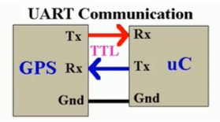
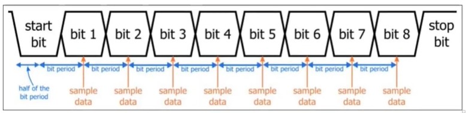

# 📌 CÁC GIAO THỨC CƠ BẢN

### Tổng quan:

## 1. UART (Universal Asynchronous Receiver – Transmitter)
|  |
| :---: |
| *Sơ đồ kết nối UART* |
#### Đặc điểm:
- **Giao tiếp nối tiếp bất đồng bộ** (không có clock).
- Truyền dữ liệu qua **2 dây chính**:
    + TX – truyền
    + RX – nhận
- Tốc độ truyền cấu hình bằng **baud rate** (9600, 115200,…).
- Không hỗ trợ nhiều thiết bị trên cùng bus (chỉ điểm–điểm).

#### Frame dữ liệu:
- Một frame UART gồm:
- Start bit
- (7/8/9) data bit
- Optional: parity bit
- 1 hoặc 2 stop bit
#### Ưu điểm
- Đơn giản, dễ dùng.
- Khoảng cách truyền xa hơn SPI/I2C.
#### Nhược điểm
- Chỉ giao tiếp 1–1.
- Không đồng bộ → dễ lỗi nếu sai baud rate.
### Quá trình UART nhận dữ liệu

UART hoạt động bất đồng bộ, vì vậy bên nhận phải tự canh thời điểm lấy mẫu dữ liệu. Quá trình nhận một frame diễn ra như sau:

- Idle: đường RX ở mức HIGH khi không truyền.
- Start bit: khi RX chuyển xuống LOW, UART nhận biết frame mới và bắt đầu đếm thời gian.
- Xác nhận start bit: UART chờ nửa chu kỳ bit rồi lấy mẫu ở giữa start bit để tránh nhiễu.
- Nhận dữ liệu: trong 8 chu kỳ tiếp theo, UART cứ mỗi 1 bit period lại lấy mẫu giữa bit để đọc từng bit dữ liệu từ bit 0 → bit 7.
- Stop bit: UART kiểm tra bit stop phải ở mức HIGH để xác nhận frame hợp lệ.

UART luôn lấy mẫu ở trung tâm mỗi bit vì đây là thời điểm tín hiệu ổn định nhất, đảm bảo đọc chính xác.

---
## 2. SPI (Serial Peripheral Interface)

#### Đặc điểm
- Giao tiếp nối tiếp đồng bộ.
- Tốc độ rất nhanh (vài MHz đến hàng chục MHz).
- Sử dụng ít nhất 4 dây:
    + MOSI – Master Out Slave In
    + MISO – Master In Slave Out
    + SCLK – Clock
    + CS/SS – Chip Select
- Hỗ trợ nhiều slave bằng nhiều chân CS.

#### Cấu trúc
- 1 Master – nhiều Slave
- Master điều khiển clock

#### Ưu điểm
- Tốc độ cao nhất trong 3 giao thức.
- Truyền full-duplex.

#### Nhược điểm
- Tốn nhiều -chân GPIO (đặc biệt nhiều slave).
- Không có chuẩn quy định cứng, mỗi hãng có thể khác nhau.

---
## 3. I2C (Inter-Integrated Circuit)
#### Đặc điểm
- Giao tiếp đồng bộ, 2 dây duy nhất:
    + SCL – Clock
    + SDA – Data
- Hỗ trợ rất nhiều thiết bị trên cùng bus (địa chỉ 7/10 bit).
- Mỗi thiết bị có một địa chỉ (address).
- Dùng điện trở kéo lên (pull-up) trên SDA, SCL.

#### Tốc độ
- Standard: 100 kHz
- Fast: 400 kHz
- Fast-plus: 1 MHz
- High-speed: 3.4 MHz

#### Ưu điểm
- Ít dây nhất (2 dây).
- Hỗ trợ multi-master, multi-slave.
- Phù hợp cảm biến nhỏ.

#### Nhược điểm
- Tốc độ thấp hơn SPI.
- Kéo điện trở → nhiễu dễ ảnh hưởng.
- Giao thức phức tạp hơn UART/SPI.

---

